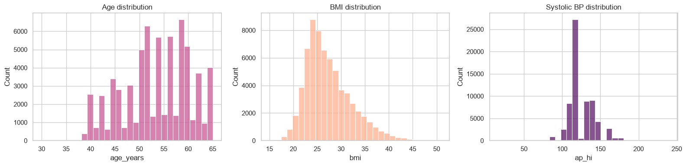
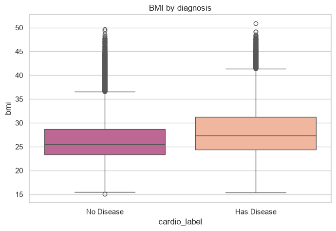

# Cardiovascular Disease — Interactive EDA Dashboard

> Week 2 internship project — exploratory data analysis on patient health records to identify patterns associated with cardiovascular disease risk, presented through an interactive Streamlit dashboard.

---

## Objective

To perform comprehensive Exploratory Data Analysis (EDA) on a real-world healthcare dataset, clean and preprocess the data, identify statistically meaningful patterns, and present findings through an interactive dashboard with user-controlled filtering and dynamic visualizations.

---

## Dataset description

| Property | Detail |
|---|---|
| **Name** | Cardiovascular Disease dataset |
| **Source** | [Kaggle — sulianova/cardiovascular-disease-dataset](https://www.kaggle.com/datasets/sulianova/cardiovascular-disease-dataset) |
| **Full dataset size** | 70,000 records, 11 features + target |
| **Bundled sample size** | 1,512 records (for fast local testing — see note below) |
| **Delimiter** | Semicolon (`;`) — not comma |
| **Target variable** | `cardio` (0 = no disease, 1 = has disease) |

### Column reference

| Column | Description |
|---|---|
| `age` | Age in **days** (cleaned to `age_years` during preprocessing) |
| `gender` | 1 = Female, 2 = Male |
| `height` | Height in cm |
| `weight` | Weight in kg |
| `ap_hi` | Systolic blood pressure |
| `ap_lo` | Diastolic blood pressure |
| `cholesterol` | 1 = Normal, 2 = Above normal, 3 = Well above normal |
| `gluc` | 1 = Normal, 2 = Above normal, 3 = Well above normal |
| `smoke` | 0 = No, 1 = Yes |
| `alco` | Alcohol intake — 0 = No, 1 = Yes |
| `active` | Physical activity — 0 = No, 1 = Yes |
| `cardio` | Target: 0 = No disease, 1 = Has disease |

---

## Data cleaning process

| Step | Action | Why |
|---|---|---|
| 1 | Remove exact duplicate rows | Prevents inflated counts and biased statistics |
| 2 | Convert `age` from days → years | Raw data stores age in days, which isn't human-interpretable |
| 3 | Median-impute missing values in `height`, `weight`, `ap_hi`, `ap_lo` | Preserves row count while avoiding outlier-sensitive mean imputation |
| 4 | Remove physiologically impossible blood pressure values (e.g. `ap_hi ≤ 0`, `ap_lo ≥ ap_hi`) | Known data-entry errors in this dataset (documented in the original Kaggle discussion) |
| 5 | Clip height/weight outliers (1st–99th percentile) | Removes data-entry typos (e.g. height = 55 cm) without losing legitimate variation |
| 6 | Engineer `bmi` feature | `weight(kg) / height(m)²` — useful derived health indicator |
| 7 | Map numeric codes → readable labels | Improves chart readability (e.g. `1` → `"Female"`) |

All steps are also visible live in the **Data Cleaning Section** of the dashboard, with row counts affected by each step.

---

## EDA methodology

1. **Dataset overview** — shape, column types, sample preview
2. **Statistical summary** — mean, median, std, min/max for key numeric variables
3. **Univariate analysis** — histogram + box plot for distribution shape, split by diagnosis
4. **Bivariate analysis** — scatter plots between any two user-selected variables
5. **Correlation analysis** — full correlation heatmap across all numeric + categorical-encoded variables
6. **Trend analysis** — disease rate plotted across age (line chart)
7. **Categorical comparison** — disease rate by gender/cholesterol/glucose group (bar chart)

---

## Key insights

1. **Age and systolic blood pressure** show the strongest correlation with cardiovascular disease among all variables tested.
2. Patients with **well-above-normal cholesterol** show roughly **2× the disease rate** of patients with normal cholesterol.
3. **Physically active** patients show a meaningfully **lower disease rate** than inactive patients.
4. Disease rate **increases gradually with age** — there's no single sharp threshold, but a steady climb.
5. **BMI alone is a weaker predictor** than direct blood pressure/cholesterol markers in this dataset.

> Full findings and recommendations: [`reports/insights_report.pdf`](reports/insights_report.pdf)

---

## Technologies used

| Tool | Purpose |
|---|---|
| Python 3.11 | Core language |
| Pandas / NumPy | Data cleaning & transformation |
| Plotly | Interactive charts |
| Matplotlib / Seaborn | Static EDA notebook charts |
| Streamlit | Dashboard framework |
| ReportLab | Insights PDF report generation |
| Jupyter Notebook | Exploratory analysis workspace |

---

## Features

- **Dataset overview** — row/column counts, dtypes, sample records
- **Data cleaning section** — missing value table, duplicate count, full cleaning log
- **Statistical summary** — `.describe()` table for key numeric columns
- **6 chart types** — histogram, scatter plot, box plot, correlation heatmap, bar chart, line chart
- **Interactive controls** — sidebar filters (gender, cholesterol, age range, activity), column selectors for X/Y axes and chart variables
- **Insights section** — dynamically computed key findings + recommendations

---

## Project structure

```
week2-eda-dashboard/
│
├── app.py                      ← Streamlit dashboard (main file)
├── dataset.csv                 ← Sample dataset (1,512 rows; see note above for full 70k version)
├── requirements.txt
├── README.md
│
├── screeshots/                 ← Dashboard screenshots            
│
├── notebooks/
│   └── eda_analysis.ipynb      ← Standalone EDA notebook
│
└── reports/
    └── insights_report.pdf     ← Generated insights & recommendations report
```

---

## Installation guide

### 1. Clone and switch to the week2 branch

```bash
git clone https://github.com/Hamna-Sajid/stacksight.git
cd stacksight
git checkout week2-eda-dashboard
```

### 2. Create a virtual environment

```bash
python -m venv venv
source venv/bin/activate      # Windows: venv\Scripts\activate
```

### 3. Install dependencies

```bash
pip install -r requirements.txt
```

---

## Run the dashboard

```bash
streamlit run app.py
```

Opens at `http://localhost:8501`.

---

## Dashboard screenshots





---

## GitHub repository

Branch: [`week2-eda-dashboard`](https://github.com/Hamna-Sajid/stacksight/tree/eda-dashboard)
Main repo: [github.com/Hamna-Sajid/stacksight](https://github.com/Hamna-Sajid/stacksight)

---

## Author

**Hamna Sajid**
